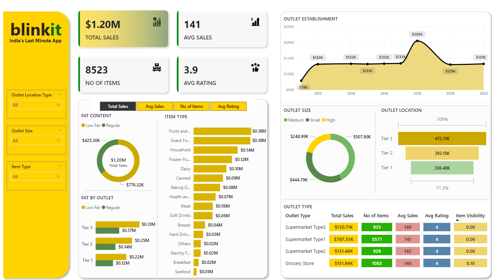

# Blinkit Sales Analysis Dashboard

## Overview

This project contains a Power BI dashboard designed to analyze sales data for Blinkit, a platform branded as "India's Last Minute App." The dashboard provides insights into total sales, average sales, the number of items, and average ratings across different outlet sizes, locations, and item types.

## Dashboard Features

- **Total Sales**: Displays the overall sales amount, which is $1.20 million.
- **Number of Items**: Total count of items sold is 8,523.
- **Average Sales**: The average sales value is 141.
- **Average Rating**: The average rating is 3.9 out of 5.

### Visualizations

- **Fat Content Analysis**: Sales distribution between low-fat and regular products.
- **Item Type Breakdown**: Bar chart showing sales figures for various item categories such as fruits, snacks, household items, and more.
- **Outlet Establishment Trend**: Line chart displaying sales trends from 2012 to 2022.
- **Outlet Size Distribution**: Pie chart indicating sales by outlet size (medium, small, high).
- **Outlet Location Sales**: Bar chart detailing sales by outlet location tiers (Tier 1, Tier 2, Tier 3).
- **Outlet Type Summary**: Table showing total sales, number of items, average sales, average rating, and item visibility across different types of supermarkets and grocery stores.

## How to Use

1. **Clone the Repository**: Clone this repository to your local machine using `git clone https://github.com/NarasimhaSwamy202/blinkit-analysis-using-PowerBI.git`.
2. **Open in Power BI**: Open the Power BI file in your Power BI Desktop to explore and interact with the data visualizations.
3. **Data Filters**: Use the filters on the left panel to view data specific to certain outlet location types, outlet sizes, or item types.
